# Airbnb Project #

## Tools and Techniques Used 
1. Front-end: HTML CSS & Bootstrap JavaScript
2. Database: Node.js Express.js
3. Backend: MongoDB 
4. Docker Deployment for MongoDB 

    `docker-compose up`

### Deployment :

1. Atlas for MongoDB 

2. Deploy project Render

## This is an Airbnb project. You can log in, add listings, give reviews, and delete listings. You can also leave reviews and view maps within the listings.

### You will see a 'Page Not Found' message first. Then, you need to click on 'Explore' on the left side
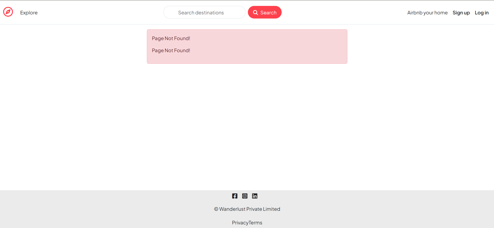

### Upon clicking on 'Explore,' the Airbnb homepage will be displayed

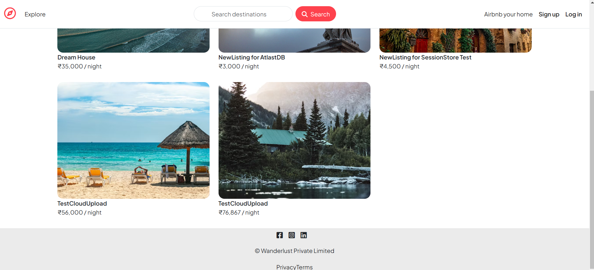

### After the homepage is displayed, click on the 'Display total after taxes' option on the right side to see the listings with GST
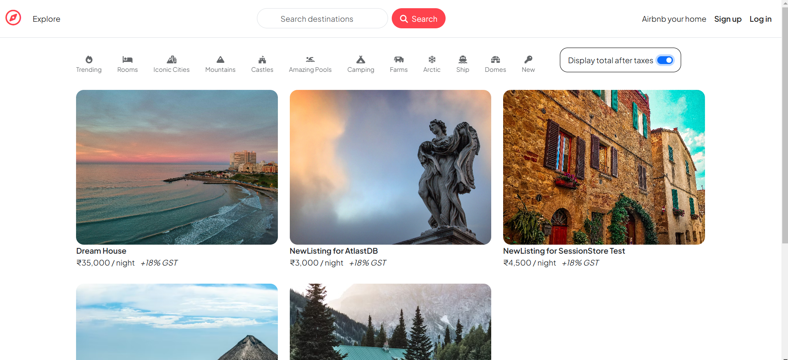

### If you want to add a new listing, you need to log in, or if you are logged in, you need to sign up
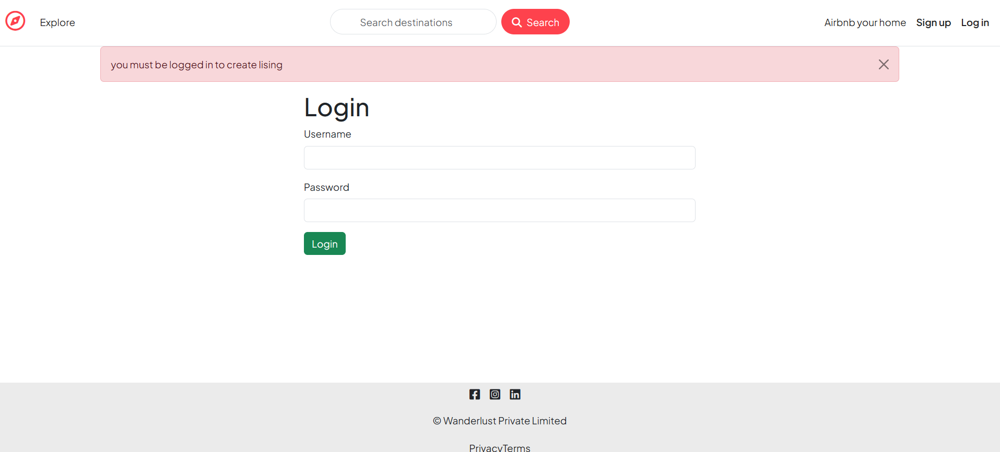
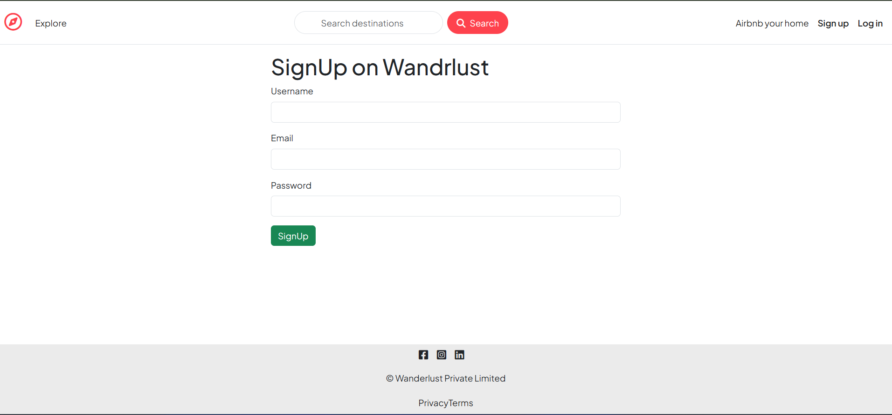

### If you want to add a new listing, you need to click on the 'Airbnb Your Home' option on the right side 
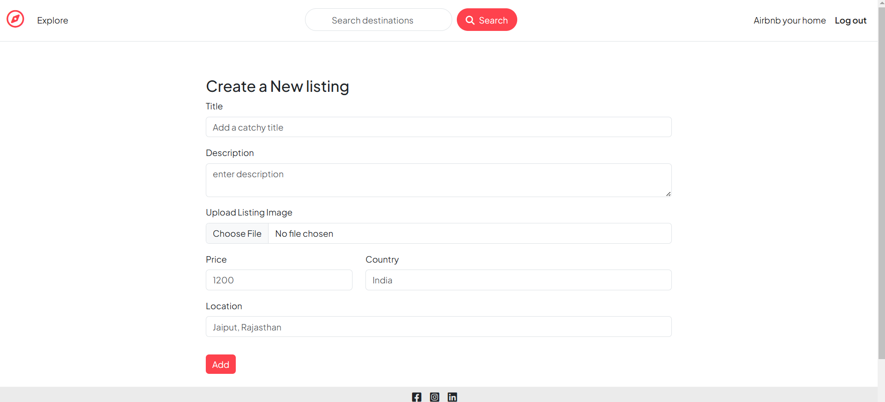

### If you have signed up, you can add a listing and modify it. You can also add reviews to the given listings. 
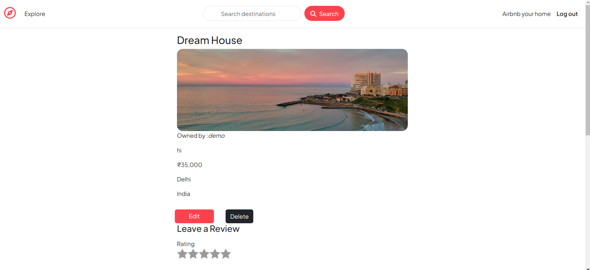
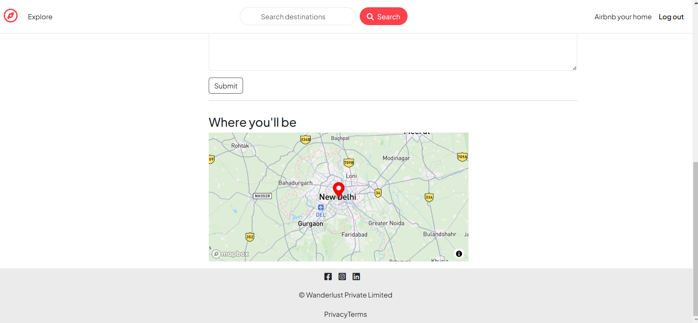

### If you want to add a review, you can go to any listing and add a review, provided you have signed up.
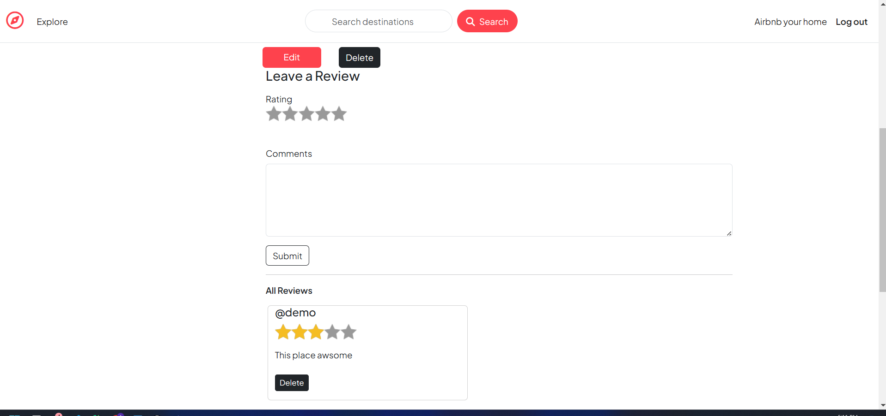
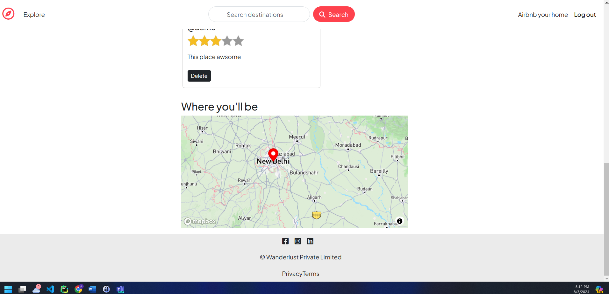

### If you have added a listing, you can also edit it 
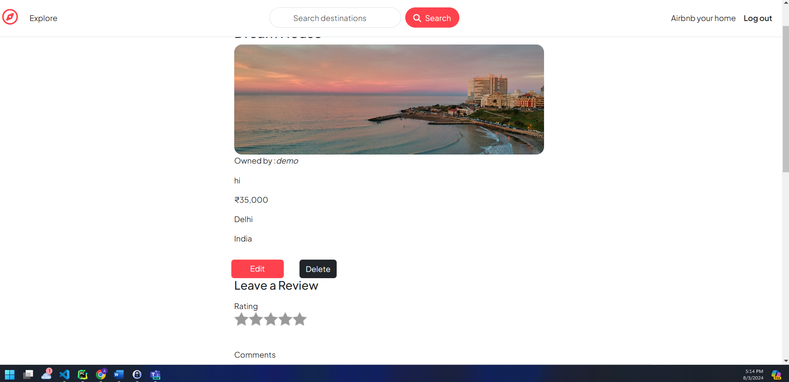
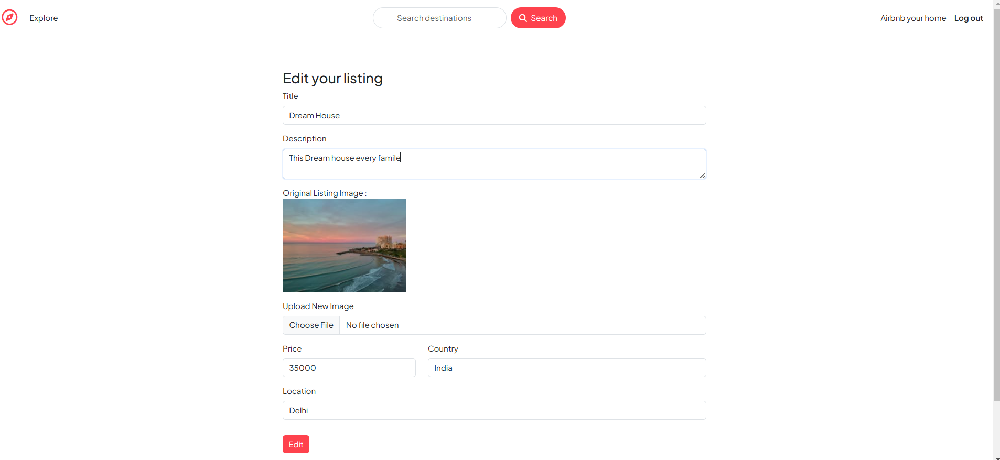
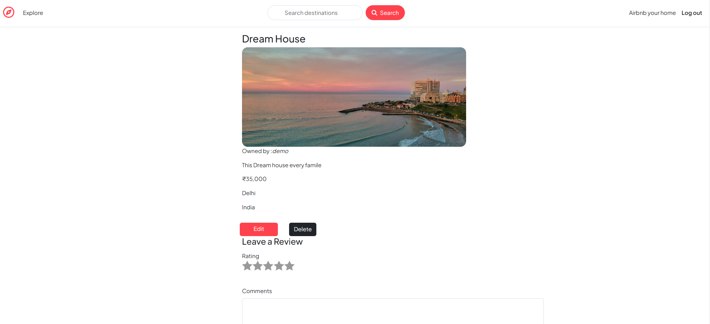

### Before deleting a listing, you will see five listings.

### And after deleting a listing...
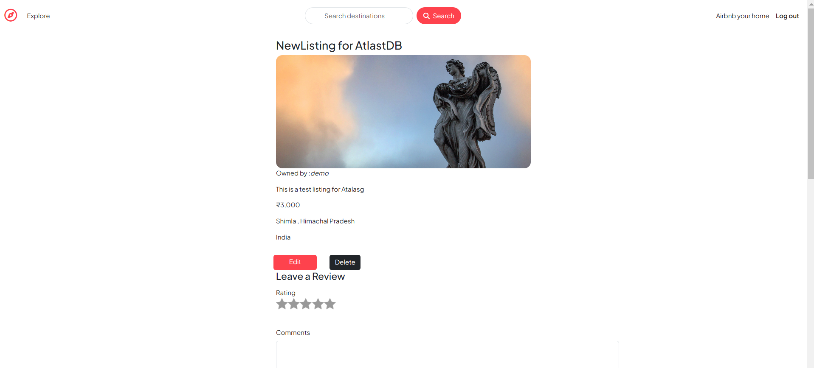
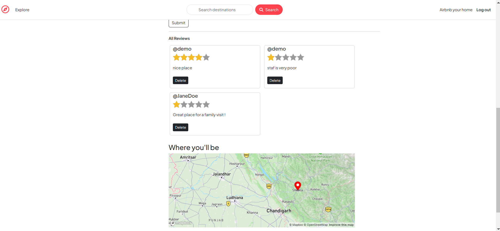
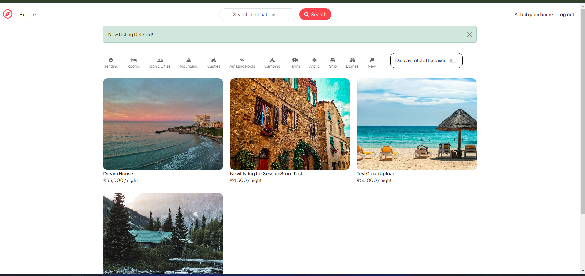

## This is an Airbnb project where users can visit, review listings, and view their details

