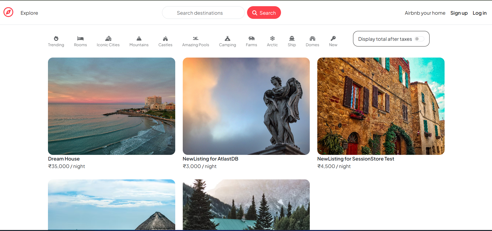

<h1>Airbnb Project<h1>

<h2>Tools and Techniques Used <h2>

1. HTML

2. CSS & Bootstrap

3. JavaScript

4. Node.js

5. Express.js

6. MongoDb

7. Docker Deployment for MongoDB 

<h5>Deployment<h5>

1. Atlas for MongoDB 

2. Deploy project Render

<h2>This is an Airbnb project. You can log in, add listings, give reviews, and delete listings. You can also leave reviews and view maps within the listings.<h2>

You will see a 'Page Not Found' message first. Then, you need to click on 'Explore' on the left side

Upon clicking on 'Explore,' the Airbnb homepage will be displayed

After the homepage is displayed, click on the 'Display total after taxes' option on the right side to see the listings with GST

If you want to add a new listing, you need to log in, or if you are logged in, you need to sign up

If you want to add a new listing, you need to click on the 'Airbnb Your Home' option on the right side

If you have signed up, you can add a listing and modify it. You can also add reviews to the given listings.

If you want to add a review, you can go to any listing and add a review, provided you have signed up.

If you have added a listing, you can also edit it

Before deleting a listing, you will see five listings.

And after deleting a listing...

This is an Airbnb project where users can visit, review listings, and view their details

